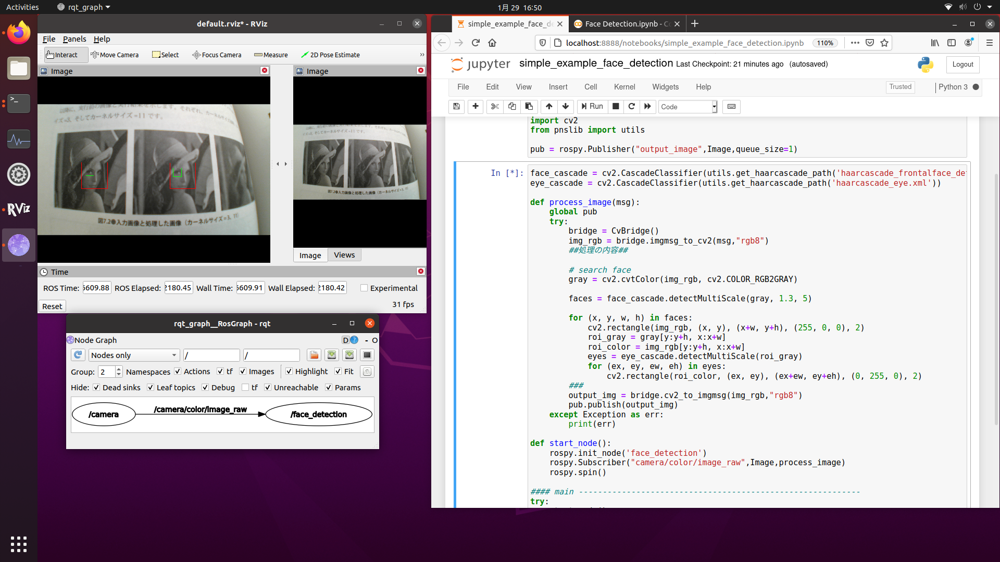

# jupyter-ros1-playground
Example program of jupyter-notebook with ROS1.  Source codes are based on Google Colaboratory.

## Link

- [Example1:PutText (&Installation(Ubuntu20))](https://github.com/Ar-Ray-code/jupyter-ros1-playground/tree/main/example1_puttext/)

- [Example2:FaceTracking](https://github.com/Ar-Ray-code/jupyter-ros1-playground/tree/main/example2_face_detection/)

- [Example3:Faster-RCNN (&Installation(Ubuntu18))](https://github.com/Ar-Ray-code/jupyter-ros1-playground/tree/main/example3_frcnn/)

## Dependence

- OS
  - Ubuntu 18.04 LTS + ROS Melodic
  - Ubuntu 20.04 LTS + ROS Noetic (Recommend)

- Python
  - 3.6 or later (Recommend version : 3.6.9)

- Jupyter-Notebook
  - 6.0.3

