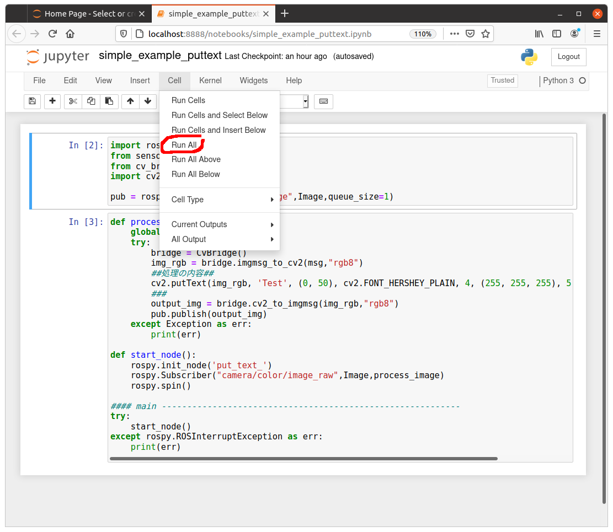

# Example1:PutText

This program is for checking the operation of cv-bridge.

## Dependence

- Ubuntu20.04 LTS
- ROS-Noetic
- Python 3.6.9 (Use pyenv)
- OpenCV : 4.5.1
- Cv-Bridge : 1.15.0

## Installation (Ubuntu 20.04 LTS)

You already finished Ubunt 20.04 LTS minimal installation.

```bash
$ sudo apt update && sudo apt upgrade
$ sudo apt install -y net-tools openssh-server git
```

Install [ROS-Noetic](http://wiki.ros.org/noetic/Installation/Ubuntu)

```bash
$ sudo sh -c 'echo "deb http://packages.ros.org/ros/ubuntu $(lsb_release -sc) main" > /etc/apt/sources.list.d/ros-latest.list'
$ sudo apt-key adv --keyserver 'hkp://keyserver.ubuntu.com:80' --recv-key C1CF6E31E6BADE8868B172B4F42ED6FBAB17C654
$ sudo apt update
$ sudo apt install ros-noetic-desktop-full
$ echo "source /opt/ros/noetic/setup.bash" >> ~/.bashrc

$ sudo apt install python3-rosdep python3-rosinstall python3-rosinstall-generator python3-wstool build-essential
$ sudo apt install python3-rosdep
$ sudo rosdep init
$ rosdep update

```

Install Jupyter-Notebook

```bash
$ sudo apt install jupyter-notebook
```

Install Pyenv (or anaconda)

```bash
$ sudo apt install build-essential libffi-dev libssl-dev zlib1g-dev liblzma-dev libbz2-dev libreadline-dev libsqlite3-dev
$ git clone https://github.com/pyenv/pyenv.git ~/.pyenv

echo 'export PYENV_ROOT="$HOME/.pyenv"' >> ~/.pyenv_init
echo 'export PATH="$PYENV_ROOT/bin:$PATH"' >> ~/.pyenv_init
echo 'eval "$(pyenv init -)"' >> ~/.pyenv_init
sudo reboot
```

Install Python3.6.9 on pyenv and setup environment.（Ubuntu20.04's Default is Python3.8.5）

```bash
$ source ~/.pyenv_init
$ pyenv install 3.6.9
$ python
## OUTPUT ----------------------------------------------------------------
## Python 3.6.9 (default, Jan 28 2021, 12:50:15)
## [GCC 9.3.0] on linux
## Type "help", "copyright", "credits" or "license" for more information.
## ------------------------------------------------------------------------
```

Install rospy etc.

```bash
$ sudo apt install python3-pip
$ pip install --upgrade pip
## Install rospy tools
$ pip install --extra-index-url https://rospypi.github.io/simple cv_bridge tf2_ros
## Check your environment
$ pip list | grep ros
## Output-----------------------
## gazebo-ros				2.9.1
## rosbag					1.15.9
## ...
## tf2-ros					0.7.5
## -----------------------------
$ pip list | grep cv
## Output-----------------------
## cv-bridge				1.15.0
## opencv-python			4.5.1.48
## -------------------------------
```

Create catkin (For ROS1-Noetic) workspace and install packages.

```bash
$ git clone https://github.com/Ar-Ray-code/movie_publisher.git catkin_ws/src/movie_publisher
$ git clone https://github.com/Ar-Ray-code/jupyter-ros1-playground.git

$ cd ~/catkin_ws/src
$ catkin_init_workspace
$ cd ../
$ catkin make
```

Installation is complete:sparkles::+1:

## Usage

Terminal 1:

```bash
$ roscore
```

Terminal 2: Connect webcamera & execute movie_publisher

```bash
$ rosrun movie_publisher webcam_pub _camera_num:=0
```

Terminal 3: Start Rviz or Rqt-image-view

Terminal 4: Load Pyenv & start Jupyter-Notebook

```bash
$ source ~/.pyenv_init
$ jupyter-notebook
```

Open simple_example_puttext in web browser and Select "Run All" to start process.



Display the result on rqt_image_view. (Subscribing "/output_image")


This tutorial is complete!:tada::tada:

