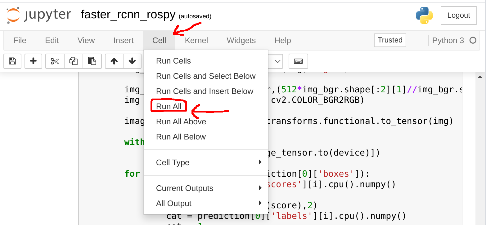

# Example3:frcnn-Jupyter-ROS (ROS1 Melodic)
 Faster R-CNN implementation packaged for ROS on Jupyter Notebook


## Dependences

#### System dependences

- ROS Melodic on Ubuntu18.04LTS (Recommend : ROS Noetic on Ubuntu20.04 LTS)
- Jupyter-notebook : 4.4.0
- Python3.6.9 (Recommend : Use anaconda or pyenv)


#### Pip packages

- opencv-python==4.4.0.42
- cv-bridge==1.13.0 (Melodic : Build by yourself)
- torch==1.7.1 (CUDA10.2)
- torchvision==0.8.2

- numpy==1.19.1

## Installation(Melodic)

- You already installed ros-melodic-desktop-full & Pytorch (Recommend : Use virtual env)

1. Install Jupyter notebook and this package

```sh
$ sudo apt update
$ sudo apt install jupyter-notebook
$ git clone https://github.com/Ar-Ray-code/jupyter-ros1-playground.git
```

2. Build cv-bridge

```sh
$ cd
$ sudo apt install python-catkin-tools python3-dev python3-catkin-pkg-modules python3-numpy python3-yaml python3-rospkg-modules
$ sudo apt install ros-melodic-desktop-full
### Build cv-bridge
$ mkdir -p cv_bridge_ws/src
$ git clone https://github.com/ros-perception/vision_opencv.git src/vision_opencv
$ cd src/vision_opencv/
$ git checkout 1.13.0
$ cd ../../
$ catkin config -DCMAKE_BUILD_TYPE=Release -DPYTHON_EXECUTABLE=/usr/bin/python3 -DPYTHON_INCLUDE_DIR=/usr/include/python3.6m -DPYTHON_LIBRARY=/usr/lib/x86-64-linux-gnu/libpython3.6m.so
$ catkin build
$ source devel/setup.bash --extend
```

3. Execute Jupyter-notebook `$ jupyter-notebook`

## Usage

Use jupyter-notebook on ROS. (Load ROS1 env to execute ros1 command)

You have to prepare trained model for Faster R-CNN and video for test.

- Terminal 1

  `$ roscore`

- Terminal 2

  I used [movie_publisher](https://github.com/Ar-Ray-code/movie_publisher) in this tutorial.

  `$ rosrun movie_publisher movie_pub _video_name:=./video.mp4`

- Jupyter-notebook

  1. Open "faster_rcnn_rospy.ipynb" in browser.
  2. Click "Cell -> RunAll" to run program.



- "faster_rcnn_rospy" node publishes only "/output_image", but I will Implement darknet_msgs.:sunglasses:


Jupyter-notebook seems a bit slow. In that case, try running it directly in python.

​	`$ python3 faster_rcnn_rospy.py `


## Reference

- Build cv-bridge :  https://qiita.com/Hiroaki-K4/items/01945ecea97c26ff8324
- Using Python3 in ros-melodic : https://qiita.com/tnjz3/items/4d64fc2d36b75e604ab1
- Code of Faster R-CNN  : https://github.com/Ryunosuke-Ikeda/colab_frcnn
- Faster R-CNN  (Pytorch) : https://pytorch.org/tutorials/intermediate/torchvision_tutorial.html
